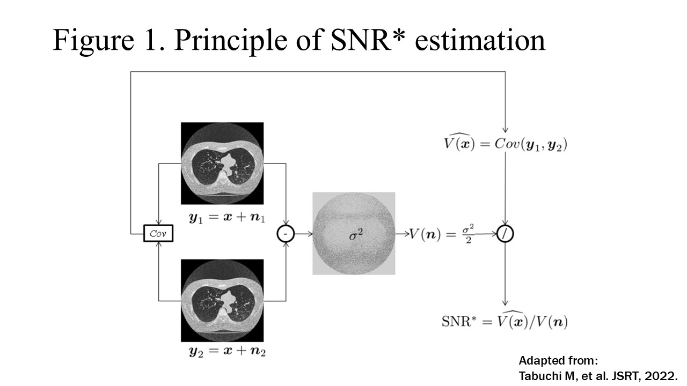
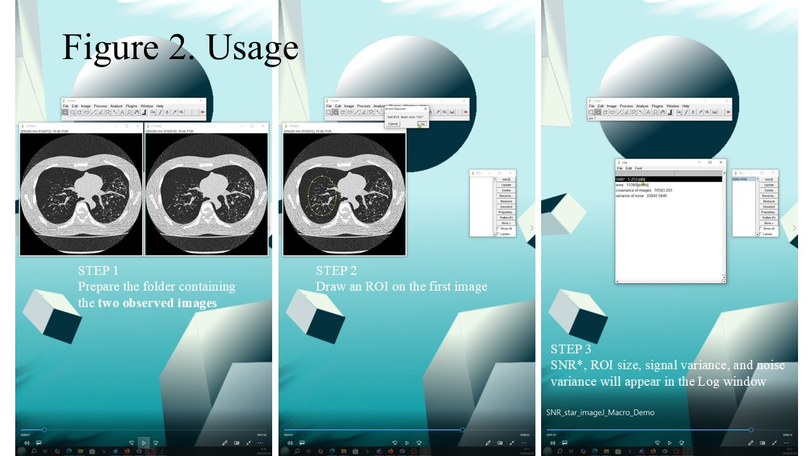

# SNR_star – Covariance-based SNR measurement

**Author:** Motohiro TABUCHI

SNR_star is an ImageJ macro that estimates signal and noise variance using the covariance between two repeated images acquired under identical imaging conditions.
It provides an unbiased and statistically optimal estimation of signal-to-noise ratio (SNR).

The method is particularly useful for image quality evaluation in X-ray CT where direct measurement of signal variance is difficult.

---

## Principle

SNR* estimates the signal variance from the covariance between two observed images acquired under identical imaging conditions.

Signal variance:

σ_s² = Cov(I₁, I₂)

Noise variance:

σ_n² = Var(I₁ − I₂) / 2

The SNR* value in decibels is defined as

SNR* [dB] = 10 log10 (σ_s² / σ_n²)

---

## Features

* Covariance-based signal variance estimation
* Noise variance estimation from the difference of images
* Outputs SNR* [dB], ROI size, signal variance, and noise variance
* Simple workflow using standard ImageJ ROI tools
* Suitable for quantitative image quality evaluation

---

## Requirements

* ImageJ 1.53 or later
* Two observed images of identical dimensions
* Images must be acquired under identical imaging conditions

---

## Usage

1. Prepare a folder containing two observed images
2. Run the SNR_star macro and select the folder containing the two observed images
3. Open the first image in ImageJ
4. Draw a region of interest (ROI)
5. Results appear in the Log window:

- SNR* [dB]
- ROI size
- signal variance
- noise variance

---

## Video

Demonstration of the SNR* tool:

https://youtube.com/shorts/qBz2MlNHiCE

---

## Download

GitHub repository

https://github.com/Motohiro-TABUCHI/SNR_star_Tool

Archived release (Zenodo)

https://zenodo.org/record/18666471

---

### Notes

- Requires two repeated images acquired under identical imaging conditions
- Assumes additive, zero-mean, independent noise between the two images
- The ROI should be selected with an appropriate shape and size to represent the signal of interest
- Inclusion of large uniform background regions may reduce the estimated SNR*
- The method is applicable to CT, MRI, and other imaging modalities with repeated acquisitions

---

## Reference


