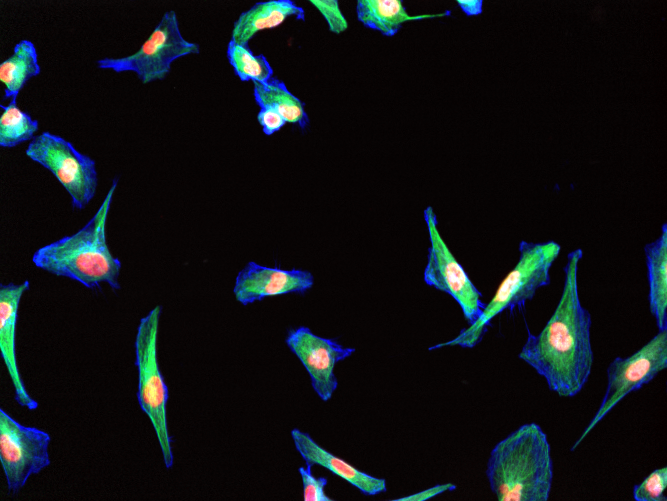
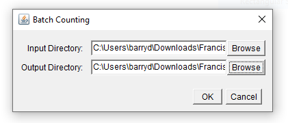
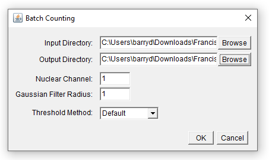

7.7---
title: Batch Processing with the ImageJ Macro Language
project: /software/imagej
---

# Overview

This tutorial demonstrates how to
1. Use [the macro recorder](../scripting/macro.md#the-recorder) to record a series of commands to form the basis of a macro
2. Edit the output from the macro recorder so that it can be run on any open image
3. Enclose the code from step 2 inside a loop so that it runs on multiple images
4. Add some progress updates
5. Add a dialog so that a user can modify the parameters to the macro prior to execution

> [!NOTE]
> Data from the [Image Data Resource](https://idr.openmicroscopy.org/) is used in this tutorial, [which is browsable online](https://idr.openmicroscopy.org/webclient/?show=image-2874779). Instructions on downloading images from the IDR are [here](https://idr.openmicroscopy.org/about/download.html). Below we outline a simple macro designed to count nuclei in 10 such images, an example of which is shown below.



# 1. Record Commands with the Macro Recorder

## 1.1 Start the macro recorder

To start the macro recorder, go to `Plugins > Macros > Record`:


Every command you now access through ImageJ's menu will be recorded as a line of text in the macro recorder.

> [!IMPORTANT]
> Some commands will not be recorded, or not recorded correctly, but the vast majority of the functionality in ImageJ/FIJI's menus is macro-recordable.

## 1.2 Perform a simple workflow

Perform a series of commands that you would like to automate with a macro. The commands recorded below resulted from:
1. The opening of an image with [Bio-Formats](https://www.openmicroscopy.org/bio-formats/), splitting channels into separate windows.
2. Selecting the first channel and applying a Gaussian blur
3. Thresholding the image with the default method
4. Generating a particle count using the `summarize` option in the [Analyze Particles](https://imagej.net/ij/docs/guide/146-30.html#sub:Analyze-Particles...) tool.


The result of the commands recorded above should look like this:


# 2. Edit the Output from the Macro Recorder

It's possible to edit commands directly within the Macro Recorder, but it's probably easier to use the [Script Editor](https://imagej.net/scripting/script-editor). You can launch the Script Editor directly from the Macro Recorder by clicking the `Create` button.


## 2.1 Save your macro and run it

Give your macro a sensible name and save it by going to `File > Save As...` in the Script Editor. Now try running your macro by selecting `Run > Run` from the menu. Your macro should produce the same output as the series of commands you recorded earlier. The code in the image above is reproduced below should you wish to copy it:

## 2.2 Generalise your macro

The obvious problem with the macro in its current form is that it will only ever work on the image that was loaded when the commands that form the basis of the macro were originally recorded. Modifying the first two lines is the first step in "generalising" the macro, so that it runs on _any_ image:
```javascript
run("Bio-Formats Importer", "autoscale color_mode=Default rois_import=[ROI manager] split_channels view=Hyperstack stack_order=XYCZT");
selectImage(1);
run("Gaussian Blur...", "sigma=2");
setAutoThreshold("Default dark");
setOption("BlackBackground", false);
run("Convert to Mask");
run("Watershed");
run("Analyze Particles...", "exclude summarize");
output = getDirectory("Select output directory");
saveAs("PNG", output + "segmentation_output.png");
```
There are three changes above:
1. On the first line, the `open` argument that was previously passed to Bio-Formats has now been removed. As such, ImageJ will produce a File Open dialog, asking the user to specify which image they wish to open with Bio-Formats
2. On the second line, the `selectImage` command has been modified to select the first image window (assuming this is the channel with the nuclei signal). Alternatively, we could have modified the Bio-Formats Importer statement to only open the first channel in the image.
3. The last two lines now ask the user to specify an output directory, before saving the segmentation mask.

While this macro will now run on any image, it only allows us to process one image at a time, which is not ideal!

# 3. Create a Loop to Run on Multiple Images

## 3.1 Enclose code within a `for` loop
We can run our code multiple times, to process multiple images, by enclosing it in a `for` loop:

```javascript
for (i = 0; i < 10; i++) {
	run("Bio-Formats Importer", "autoscale color_mode=Default rois_import=[ROI manager] split_channels view=Hyperstack stack_order=XYCZT");
	selectImage(1);
	run("Gaussian Blur...", "sigma=2");
	setAutoThreshold("Default dark");
	setOption("BlackBackground", false);
	run("Convert to Mask");
	run("Watershed");
	run("Analyze Particles...", "exclude summarize");
	output = getDirectory("Select output directory");
	saveAs("PNG", output + "segmentation_output.png");
}
```
However, there are a number of problems with the above code:
1. The user is required to specify the input image and output directory on each iteration of the loop
2. The loop only will always run exactly 10 times...
3. ...which will result in a lot of image windows being opened
4. The output image will have the same name for each iteration of the loop

Let's deal with each of these one at a time.

## 3.2 Obtain an input directory

Let's add some code before the `for` loop to get an input directory and obtain a list of files from that input directory. We can also move the line of code specifying the output directory here so it doesn't get called every time the loop is executed:

```javascript
inputDir = getDirectory("Select Input Directory");
images = getFileList(inputDir);
output = getDirectory("Select output directory");
```

Now we need to update the command that runs the Bio-Formats Importer, such that it opens a different image on each iteration of the loop:
```javascript
run("Bio-Formats Importer", "open=[" + inputDir + File.separator() + images[i] + "] autoscale color_mode=Composite rois_import=[ROI manager] view=Hyperstack stack_order=XYCZT");
```

## 3.3 Close windows when we're done with them

The macro in its current form will open four windows every time the `for` loop is executed (assuming the input images have four channels). Multiply this by the number of times the loop gets executed (currently 10) and that's a lot of windows. We can deal with this by adding a `close` statement to the end of the code block within the `for` loop. Using a wildcard character (`*`) with the `close` statement instructs ImageJ to close _all_ image windows:
```javascript
close("*");
```
The complete macro now looks like this...
```javascript
inputDir = getDirectory("Select Input Directory");
images = getFileList(inputDir);
output = getDirectory("Select output directory");

for (i = 0; i < 10; i++) {
	run("Bio-Formats Importer", "open=[" + inputDir + File.separator() + images[i] + "] autoscale color_mode=Default rois_import=[ROI manager] split_channels view=Hyperstack stack_order=XYCZT");
	selectImage(1);
	run("Gaussian Blur...", "sigma=2");
	setAutoThreshold("Default dark");
	setOption("BlackBackground", false);
	run("Convert to Mask");
	run("Watershed");
	run("Analyze Particles...", "exclude summarize");
	saveAs("PNG", output + "segmentation_output.png");
	close("*");
}
```
...and should now produce some meaningful output when run:


## 3.3 Run the loop required number of times

At present, the code within the `for` loop will always be executed exactly 10 times, regardless of how many images there are in the input directory. We can change this behaviour for placing something more meaningful in the conditional statement `i < 10`, such as:
```javascript
for (i = 0; i < lengthOf(images); i++) {
```
Here, the `lengthOf` command returns the length of the `images` array, so the `for` loop will continue to be executed until all images in the array have been analysed.

## 3.4 Change the name of the output image

Finally, in order to have a fully functional (if rudimentary) macro, we need the name of the segmentation output image to be updated on each iteration of the `for` loop - at present, an image with the name `segmentation_output.png` is repeatedly overwritten. We could modify the `saveAs` statement to include the current value of `i` in the filename as follows:
```javascript
saveAs("PNG", output + "segmentation_output_" + i + ".png");
```
This will result in output images being saved as:
```
segmentation_output_0.png
segmentation_output_1.png
segmentation_output_2.png
...
```
To be more informative, we could include the input filename in the output image filename, as follows:
```javascript
saveAs("PNG", output + "segmentation_output_" + images[i] + ".png");
```
The complete script now looks like this:
```javascript
inputDir = getDirectory("Select Input Directory");
images = getFileList(inputDir);
output = getDirectory("Select output directory");

for (i = 0; i < lengthOf(images); i++) {
	run("Bio-Formats Importer", "open=[" + inputDir + File.separator() + images[i] + "] autoscale color_mode=Default rois_import=[ROI manager] split_channels view=Hyperstack stack_order=XYCZT");
	selectImage(1);
	run("Gaussian Blur...", "sigma=2");
	setAutoThreshold("Default dark");
	setOption("BlackBackground", false);
	run("Convert to Mask");
	run("Watershed");
	run("Analyze Particles...", "exclude summarize");
	saveAs("PNG", output + "segmentation_output_" + images[i] + ".png");
	close("*");
}
```
# 4. Add Some Progress Updates

It's generally a good idea to keep the user informed of progress when code is running. We can do this by adding `print` statements at different points in the macro, so updates get printed to the Log window:
```javascript
inputDir = getDirectory("Select Input Directory");
images = getFileList(inputDir);
output = getDirectory("Select output directory");

setBatchMode(true);

print("\\Clear");
print("Found " + images.length + " files in " + inputDir);
print("0% of images processed.");

for (i = 0; i < lengthOf(images); i++) {
	print("\\Update:" + (100.0 * i / images.length) + "% of images processed.");
	run("Bio-Formats Importer", "open=[" + inputDir + File.separator() + images[i] + "] autoscale color_mode=Default rois_import=[ROI manager] split_channels view=Hyperstack stack_order=XYCZT");
	selectImage(1);
	run("Gaussian Blur...", "sigma=2");
	setAutoThreshold("Default dark");
	setOption("BlackBackground", false);
	run("Convert to Mask");
	run("Watershed");
	run("Analyze Particles...", "exclude summarize");
	saveAs("PNG", output + "segmentation_output_" + images[i] + ".png");
	close("*");
}
print("\\Update:100% of images processed.");

setBatchMode(false);
```
The `setBatchMode` statements cause ImageJ to enter, then exit, "Batch Mode", which suppresses image windows. This allows the macro to execute faster.

# 5. Create a Dialog to Obtain User Input

As an alternative to the `getDirectory` statements used above, it is possible to create a more functional, self-contained dialog to receive input from the user.

## 5.1 Specify inputs and outputs

We can create and customise a [Generic Dialog](../../scripting/generic-dialog) to obtain a variety of different inputs from the user. We can also use this interface to provide instructions to the user. Let's begin with a simple dialog that prompts the user to specify input and output directories:

```javascript
var inputDir;
var output;

Dialog.create("Batch Counting");
Dialog.addDirectory("Input Directory:", inputDir);
Dialog.addDirectory("Output Directory:", output);
Dialog.show();

inputDir = Dialog.getString();
output = Dialog.getString();
```

The code above does three things:
1. Initialise two variables for the input and output directories. These can be initialised with specific file locations if desired (e.g. `var inputDir = "C:/Users/barryd";`)
2. Create a dialog with two directory selection fields and buttons
3. Obtain the specified input and output directories when the user closes the dialog by clicking `OK`. If he user clicks `Cancel`, the macro exits.

Running the macro now should produce the following dialog:



## 5.2 Modifying parameters via a dialog

In addition to specifying input and output directories, there are a range of other controls that can be added to a dialog. For example, we can add fields allowing the user to specify...
1. a filter radius for Gaussian smoothing
2. a particular thresholding method from the full list available in ImageJ
3. which channel corresponds to nuclei

Note that we can initialise the dialog with default values.
```javascript
var inputDir;
var output;
var gaussRad = 1.0;
var thresholdMethod = "Default";
var allThreshMethods = getList("threshold.methods");
var nucleiIndex = 1;

Dialog.create("Batch Counting");
Dialog.addDirectory("Input Directory:", inputDir);
Dialog.addDirectory("Output Directory:", output);
Dialog.addNumber("Nuclear Channel:", nucleiIndex);
Dialog.addNumber("Gaussian Filter Radius:", gaussRad);
Dialog.addChoice("Threshold Method:", allThreshMethods);
Dialog.show();

inputDir = Dialog.getString();
output = Dialog.getString();
nucleiIndex = Dialog.getNumber();
gaussRad = Dialog.getNumber();
thresholdMethod = Dialog.getChoice();
```
> [!TIP]
> For a full list of controls that can be added to a Dialog, see the [relevant macro language documentation](https://wsr.imagej.net/developer/macro/functions.html#dialog).

Running the macro will now produce a dialog that looks like this:



In order for the variables captured from the dialog to have any effect, we must modify the remainder of the code, placing the variables where they are needed:
```javascript
images = getFileList(inputDir);

setBatchMode(true);

print("\\Clear");
print("Found " + images.length + " files in " + inputDir);
print("0% of images processed.");

for (i = 0; i < lengthOf(images); i++) {
	print("\\Update:" + (100.0 * i / images.length) + "% of images processed.");
	run("Bio-Formats Importer", "open=[" + inputDir + File.separator() + images[i] + "] autoscale color_mode=Default rois_import=[ROI manager] split_channels view=Hyperstack stack_order=XYCZT");
	selectImage(nucleiIndex);
	run("Gaussian Blur...", "sigma=" + gaussRad);
	setAutoThreshold(thresholdMethod + " dark");
	setOption("BlackBackground", false);
	run("Convert to Mask");
	run("Watershed");
	run("Analyze Particles...", "exclude summarize");
	saveAs("PNG", output + "segmentation_output_" + images[i] + ".png");
	close("*");
}
print("\\Update:100% of images processed.");

setBatchMode(false);
```
Note the following:
1. The `selectImage` command now takes `nucleiIndex` as an argument
2. The `run("Gaussian Blur...")` command now takes it's `sigma` parameter from `gaussRad`
3. `setAutoThreshold` uses whatever method is specified by `thresholdMethod`

# 6. Installing the Macro

It is possible to ["install" macros in ImageJ](https://imagej.net/scripting/macro#installing-macros), such that they appear on the Plugins menu. In order to do so, we first need to wrap our macro in `macro` blocks. With the `macro` blocks added, our complete macro now looks as follows:
```javascript
macro "Batch Nuclei Counter" {
	var inputDir;
	var output;
	var gaussRad = 1.0;
	var thresholdMethod = "Default";
	var allThreshMethods = getList("threshold.methods");
	var nucleiIndex = 1;
	
	Dialog.create("Batch Counting");
	Dialog.addDirectory("Input Directory:", inputDir);
	Dialog.addDirectory("Output Directory:", output);
	Dialog.addNumber("Nuclear Channel:", nucleiIndex);
	Dialog.addNumber("Gaussian Filter Radius:", gaussRad);
	Dialog.addChoice("Threshold Method:", allThreshMethods);
	Dialog.show();
	
	inputDir = Dialog.getString();
	output = Dialog.getString();
	nucleiIndex = Dialog.getNumber();
	gaussRad = Dialog.getNumber();
	thresholdMethod = Dialog.getChoice();
	
	images = getFileList(inputDir);
	
	setBatchMode(true);
	
	print("\\Clear");
	print("Found " + images.length + " files in " + inputDir);
	print("0% of images processed.");
	
	for (i = 0; i < lengthOf(images); i++) {
		print("\\Update:" + (100.0 * i / images.length) + "% of images processed.");
		run("Bio-Formats Importer", "open=[" + inputDir + File.separator() + images[i] + "] autoscale color_mode=Default rois_import=[ROI manager] split_channels view=Hyperstack stack_order=XYCZT");
		selectImage(nucleiIndex);
		run("Gaussian Blur...", "sigma=" + gaussRad);
		setAutoThreshold(thresholdMethod + " dark");
		setOption("BlackBackground", false);
		run("Convert to Mask");
		run("Watershed");
		run("Analyze Particles...", "exclude summarize");
		saveAs("PNG", output + "segmentation_output_" + images[i] + ".png");
		close("*");
	}
	print("\\Update:100% of images processed.");
	
	setBatchMode(false);
}
```
Find the _scripts_ folder within your ImageJ/FIJI installation and save your macro within the _Plugins_ subdirectory. You should now see your macro appear at the bottom of the Plugins menu when you restart the application:


# 7. Add Comments to your Code
